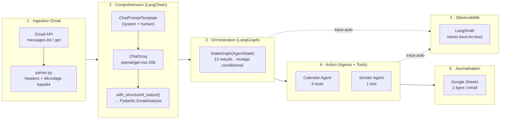
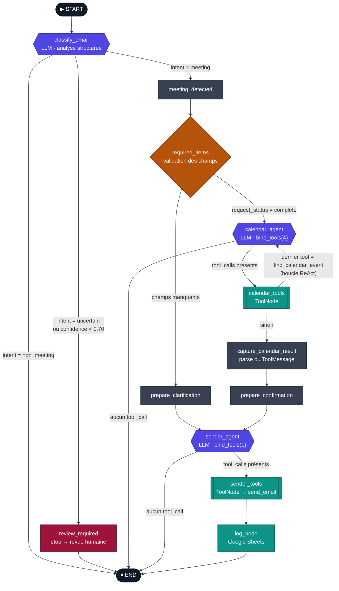

<div align="center">

# 📬 Agentic Mailing Services

**Un agent IA qui lit votre dernier email, comprend s'il s'agit d'une demande de réunion,
agit sur Google Calendar, répond à l'expéditeur, puis journalise tout.**

Orchestré par **LangGraph** · Raisonnement **LangChain + Groq** · Observé par **LangSmith**


</div>

---

## 🧭 Sommaire

| | |
|---|---|
| [✨ Ce que fait le projet](#-ce-que-fait-le-projet) | [🗺️ Vue d'ensemble](#️-vue-densemble-6-couches) |
| [🕸️ Le graphe LangGraph](#️-le-graphe-langgraph-le-cœur-du-projet) | [🔄 Le flow, étape par étape](#-le-flow-étape-par-étape) |
| [🧩 Tous les concepts LangChain / LangGraph](#-tous-les-concepts-langchain--langgraph-utilisés) | [📦 Le State](#-le-state-la-mémoire-partagée-du-graphe) |
| [🧱 Référence des nœuds](#-référence-des-nœuds) | [🛠️ Référence des tools](#️-référence-des-tools) |
| [🏗️ Structure du projet](#️-structure-du-projet) | [🚀 Installation & exécution](#-installation--exécution) |
| [🔬 Observabilité : LangSmith](#-observabilité--langsmith--langgraph-dev) | [🧭 Roadmap & limites connues](#-roadmap--limites-connues) |

---

## ✨ Ce que fait le projet

À chaque exécution, le pipeline :

1. 📥 **Récupère** le tout dernier email de votre boîte Gmail (via l'API, pas d'IMAP).
2. 🧠 **Comprend** l'email avec un LLM : est-ce une demande de réunion ? Laquelle : *créer / confirmer / reporter / annuler* ? Avec quel niveau de confiance ?
3. 🚦 **Décide** de la route :
   - email non lié à une réunion → on s'arrête ;
   - email ambigu ou confiance faible → on s'arrête **pour revue humaine** ;
   - demande claire mais **informations manquantes** (date, heure, titre…) → on envoie un email de **clarification** ;
   - demande **complète** → on agit sur le calendrier.
4. 📅 **Agit** sur Google Calendar via un **agent outillé** : `create`, `find`, `reschedule`, `cancel`.
5. ✉️ **Répond** à l'expéditeur (dans le même fil de discussion) : confirmation de l'action réalisée, ou demande de précisions.
6. 📊 **Journalise** chaque traitement dans une feuille Google Sheets.
7. 🔬 **Trace** l'intégralité de l'exécution dans LangSmith (chaque nœud, chaque appel LLM, chaque tool call).

---

## 🗺️ Vue d'ensemble (6 couches)



| Couche | Fichiers clés | Rôle |
|--------|---------------|------|
| **1. Ingestion** | [`Gmail/Client.py`](Gmail/Client.py), [`Gmail/mailing.py`](Gmail/mailing.py), [`Gmail/parser.py`](Gmail/parser.py), [`Gmail/auth.py`](Gmail/auth.py) | OAuth Google, récupération et parsing du dernier email en `dict` propre |
| **2. Compréhension** | [`AI/prompts.py`](AI/prompts.py), [`AI/llm.py`](AI/llm.py), [`AI/schema.py`](AI/schema.py), [`AI/classifier.py`](AI/classifier.py) | Chaîne LangChain qui transforme l'email en analyse structurée typée |
| **3. Orchestration** | [`Graph/State.py`](Graph/State.py), [`Graph/Nodes.py`](Graph/Nodes.py), [`Graph/graph.py`](Graph/graph.py) | Le graphe d'états : nœuds, arêtes, routeurs conditionnels |
| **4. Action** | [`Agents/Calendar_agent.py`](Agents/Calendar_agent.py), [`Agents/Sender_agent.py`](Agents/Sender_agent.py), [`Tools/`](Tools/) | Agents LLM outillés + implémentation des tools Google |
| **5. Observabilité** | [`Monitoring/langsmith_monitor.py`](Monitoring/langsmith_monitor.py) | Point d'entrée qui active le tracing LangSmith |
| **6. Journalisation** | [`Tools/Logs_tool.py`](Tools/Logs_tool.py) | Append d'une ligne d'audit dans Google Sheets |

---

## 🕸️ Le graphe LangGraph (le cœur du projet)

> C'est ici que tout se joue. Le graphe est un **automate** : chaque **nœud** est une fonction Python qui reçoit le `State`, fait son travail, et renvoie une **mise à jour partielle** du `State`. Les **arêtes** décident du nœud suivant — certaines sont fixes, d'autres **conditionnelles** (un routeur Python lit le `State` et renvoie un nom de branche).



**Légende**

| Forme / couleur | Signification |
|---|---|
| 🟦 `{{ … }}` indigo | Nœud qui **appelle un LLM** (`classify_email`, `calendar_agent`, `sender_agent`) |
| 🟩 `[[ … ]]` sarcelle | **`ToolNode`** LangGraph : exécute les tools demandés par l'agent |
| 🟧 losange orange | Nœud/routeur de **validation & décision** |
| 🟥 rouge | **Point d'arrêt** volontaire (revue humaine) |
| ⬛ gris | Nœud « plumbing » : pose un drapeau dans le `State` |
| flèche étiquetée | **Arête conditionnelle** : le texte = valeur renvoyée par le routeur |

<details>
<summary>📖 Les 3 routeurs conditionnels en détail (code réel)</summary>

### `route_email` — après `classify_email`
```python
if intent == "non_meeting":                 return "non_meeting"   # → END
if intent == "uncertain":                   return "review"        # → review_required → END
if confidence is not None and confidence < 0.70:  return "review"   # garde-fou de confiance
return "meeting"                                                    # → meeting_detected
```

### `route_required_items` — après `required_items`
```python
if state["request_status"] == "complete":   return "calendar"       # → calendar_agent
return "clarification"                                              # → prepare_clarification
```
`required_items_node` définit les champs obligatoires selon l'action :
| `meeting_action` | Champs requis dans `meeting_details` |
|---|---|
| `create` | `date`, `time` |
| `reschedule` | `title`, `date`, `time` |
| `cancel` | `title` |
| *(autre)* | échoue → `missing_fields = ["meeting_action"]` |

### `route_after_calendar_tool` — après `calendar_tools`
```python
last_tool = messages[-1].name
if last_tool == "find_calendar_event":      return "agent"          # reboucle : l'agent doit encore agir
return "confirmation"                                              # → capture_calendar_result
```
👉 C'est ce qui crée la **boucle ReAct** pour `reschedule` / `cancel` :
`calendar_agent → find_calendar_event → calendar_agent → reschedule/cancel → capture_calendar_result`.

### `tools_condition` (fourni par LangGraph)
Utilisé après `calendar_agent` **et** `sender_agent`. Regarde le dernier message :
s'il contient des `tool_calls` → va au `ToolNode` ; sinon → `END`.
</details>

<details>
<summary>🔁 Les 3 chemins de bout en bout</summary>

**A. Chemin « rien à faire »**
`START → classify_email → END`
(email promotionnel, newsletter, simple mention d'une réunion…)

**B. Chemin « revue humaine »**
`START → classify_email → review_required → END`
(intent `uncertain`, ou `confidence < 0.70` — l'agent refuse d'agir tout seul)

**C. Chemin « clarification »**
`START → classify_email → meeting_detected → required_items → prepare_clarification → sender_agent → sender_tools → log_node → END`
(demande de réunion valide mais `date`/`time`/`title` manquants → email qui demande les infos)

**D. Chemin nominal « action réalisée »**
`START → classify_email → meeting_detected → required_items → calendar_agent ⇄ calendar_tools → capture_calendar_result → prepare_confirmation → sender_agent → sender_tools → log_node → END`
(création/report/annulation effectuée sur Calendar, puis email de confirmation dans le fil d'origine)
</details>

---

## 🔄 Le flow, étape par étape

<details open>
<summary><b>Étape 1 — Ingestion Gmail</b></summary>

- [`Gmail/auth.py`](Gmail/auth.py) : `authenticate()` gère le flux **OAuth 2.0 Google**. Scopes demandés : `gmail.readonly`, `gmail.send`, `calendar`, `spreadsheets`. Le jeton est mis en cache dans `token.json` et rafraîchi automatiquement.
- [`Gmail/mailing.py`](Gmail/mailing.py) : `get_latest_email()` appelle `messages.list(maxResults=1)` puis `messages.get(format="full")`. L'API Gmail ne « livre » pas le mail directement : elle renvoie des identifiants, à nous de « puller » le contenu.
- [`Gmail/parser.py`](Gmail/parser.py) : `parse_email()` extrait les **headers** (`from`, `to`, `subject`, `date`), décode le corps `text/plain` encodé en **base64 URL-safe**, et gère le cas `multipart/*`. Sortie :
  ```python
  {"message_id", "thread_id", "labels", "from", "to", "subject", "date", "body"}
  ```
</details>

<details>
<summary><b>Étape 2 — Compréhension : la chaîne LangChain</b></summary>

Tout est assemblé dans [`AI/classifier.py`](AI/classifier.py) :

```python
llm = get_llm()                                   # ChatGroq(model="openai/gpt-oss-20b", temperature=0)
structured_llm = llm.with_structured_output(EmailAnalysis)   # force une sortie conforme au schéma Pydantic
chain = email_analysis_prompt | structured_llm    # LCEL : le "|" branche prompt → LLM
result = chain.invoke({"sender": ..., "email_date": ..., "subject": ..., "body": ...})
```

- **`email_analysis_prompt`** ([`AI/prompts.py`](AI/prompts.py)) : un `ChatPromptTemplate` à 2 messages (`system` = règles très détaillées : ne pas confondre « le mot *meeting* » avec une vraie demande, ne jamais inventer de date… ; `human` = les métadonnées + le corps de l'email).
- **`EmailAnalysis`** ([`AI/schema.py`](AI/schema.py)) : le contrat de sortie.
  ```
  intent          : "meeting" | "non_meeting" | "uncertain"
  meeting_action  : "create" | "confirm" | "reschedule" | "cancel" | "unknown" | None
  confidence      : float (0..1)
  reason          : str
  meeting_details : MeetingDetails | None
      └─ title, date (YYYY-MM-DD), time (HH:MM), previous_date, previous_time,
         timezone (IANA), duration_minutes, location, participants, raw_datetime_text
  ```
- **`with_structured_output`** : garantit que le LLM renvoie un objet Pydantic valide (pas du texte libre à parser à la main).
</details>

<details>
<summary><b>Étape 3 — Le nœud d'entrée du graphe : <code>classify_email</code></b></summary>

[`Graph/Nodes.py`](Graph/Nodes.py) → `classify_email_node(state)` :
- lit `state["email"]`, appelle `analyze_email()`,
- convertit `meeting_details` (Pydantic) en `dict` via `.model_dump()`,
- renvoie `{"intent", "meeting_action", "confidence", "reason", "meeting_details"}` → fusionné dans le `State`.

Puis `route_email` aiguille vers `meeting_detected`, `review_required` ou directement `END`.
</details>

<details>
<summary><b>Étape 4 — Validation : <code>meeting_detected</code> → <code>required_items</code></b></summary>

- `meeting_detected_node` : pose `status = "meeting_detected"` (marqueur).
- `required_items_node` : vérifie que `meeting_details` contient les champs **obligatoires selon l'action** (cf. tableau plus haut). Sortie :
  ```python
  {"request_status": "complete" | "incomplete",
   "missing_fields": [...],
   "response_type": "clarification" | None}
  ```
- `route_required_items` : `complete` → `calendar_agent` ; sinon → `prepare_clarification`.
</details>

<details>
<summary><b>Étape 5 — L'agent Calendar (boucle ReAct outillée)</b></summary>

[`Agents/Calendar_agent.py`](Agents/Calendar_agent.py) :

```python
calendar_tools = [create_calendar_event, find_calendar_event,
                  reschedule_calendar_event, cancel_calendar_event]
calendar_llm = get_llm().bind_tools(calendar_tools)   # le LLM "sait" appeler ces 4 fonctions
```

`calendar_agent_node(state)` :
1. Construit un `SystemMessage` qui **injecte l'état autoritaire** (`meeting_action`, `meeting_details`) et interdit au LLM de ré-interpréter l'email d'origine.
2. `response = calendar_llm.invoke([system_message] + state["messages"])`.
3. Renvoie `{"messages": [response]}` — grâce au **reducer `add_messages`**, ce message est **ajouté** à l'historique (pas écrasé).

Ensuite :
- `tools_condition` : si `response.tool_calls` → `calendar_tools` (un **`ToolNode`** qui exécute réellement les fonctions Google) ; sinon → `END`.
- Après `calendar_tools`, `route_after_calendar_tool` : si le dernier tool était `find_calendar_event`, on **reboucle** vers `calendar_agent` (il lui reste à appeler `reschedule`/`cancel` avec l'`event_id` trouvé). Sinon → `capture_calendar_result`.

`capture_calendar_result_node` : lit le dernier `ToolMessage`, parse son `content` (dict, JSON, ou `ast.literal_eval` en dernier recours) et le range dans `state["calendar_result"]`.
</details>

<details>
<summary><b>Étape 6 — Préparation de la réponse</b></summary>

- `prepare_confirmation_node` → `response_type = "confirmation"` (une action Calendar a réussi).
- `prepare_clarification_node` → `response_type = "clarification"` (il manque des infos).

Ces deux nœuds ne font que **poser un drapeau** ; c'est le Sender Agent qui rédige.
</details>

<details>
<summary><b>Étape 7 — L'agent Sender</b></summary>

[`Agents/Sender_agent.py`](Agents/Sender_agent.py) :

```python
sender_tools = [send_email]
sender_llm = get_llm().bind_tools(sender_tools)
```

`sender_agent_node(state)` : `SystemMessage` avec tout le contexte autoritaire (expéditeur, `subject`, `thread_id`, `response_type`, `meeting_action`, `meeting_details`, `missing_fields`, `calendar_result`) + règles :
- `clarification` → demander **uniquement** les infos manquantes, ne rien affirmer ;
- `confirmation` → confirmer **uniquement** une action réellement réalisée ;
- répondre à l'expéditeur d'origine, garder le **même fil** (`thread_id`), sujet en `Re:`, appeler `send_email` **exactement une fois**.

`tools_condition` → `sender_tools` (`ToolNode`) exécute `send_email` via l'API Gmail.
</details>

<details>
<summary><b>Étape 8 — Journalisation Google Sheets</b></summary>

[`Graph/Nodes.py`](Graph/Nodes.py) → `log_node(state)` appelle le tool [`append_log_row`](Tools/Logs_tool.py) qui ajoute **une ligne** (colonnes A→N) dans la feuille `logs` du spreadsheet configuré : timestamp, `message_id`, `thread_id`, expéditeur, sujet, `intent`, `meeting_action`, `confidence`, `request_status`, `missing_fields`, `response_type`, etc. Puis → `END`.
</details>

---

## 🧩 Tous les concepts LangChain / LangGraph utilisés

| Concept | Ce que c'est | Où vous l'utilisez |
|---|---|---|
| **`ChatGroq`** | Client LLM (LangChain) vers l'inférence Groq | [`AI/llm.py`](AI/llm.py) — `openai/gpt-oss-20b`, `temperature=0` |
| **`ChatPromptTemplate`** | Gabarit de prompt multi-messages avec variables `{…}` | [`AI/prompts.py`](AI/prompts.py) |
| **LCEL (`\|`)** | *LangChain Expression Language* : compose des `Runnable` en pipeline | `email_analysis_prompt \| structured_llm` dans [`AI/classifier.py`](AI/classifier.py) |
| **`with_structured_output(Model)`** | Contraint la sortie du LLM à un schéma Pydantic | [`AI/classifier.py`](AI/classifier.py) + [`AI/schema.py`](AI/schema.py) |
| **Schéma Pydantic** | Contrat de données typé + `Field(description=…)` qui guide le LLM | `EmailAnalysis`, `MeetingDetails` dans [`AI/schema.py`](AI/schema.py) |
| **`@tool`** | Décorateur qui transforme une fonction Python (+ docstring + signature typée) en outil appelable par un LLM | [`Tools/Calandar_tools.py`](Tools/Calandar_tools.py), [`Tools/Gmail_sending_tool.py`](Tools/Gmail_sending_tool.py), [`Tools/Logs_tool.py`](Tools/Logs_tool.py) |
| **`llm.bind_tools([...])`** | Donne au LLM le *schéma* des tools : il peut alors émettre des `tool_calls` | [`Agents/Calendar_agent.py`](Agents/Calendar_agent.py), [`Agents/Sender_agent.py`](Agents/Sender_agent.py) |
| **`ToolNode`** | Nœud LangGraph qui **exécute** les `tool_calls` du dernier message et renvoie des `ToolMessage` | `calendar_tools_node`, `sender_tools_node` dans [`Graph/graph.py`](Graph/graph.py) |
| **`tools_condition`** | Routeur prêt-à-l'emploi : « des `tool_calls` ? → tools, sinon → fin » | après `calendar_agent` et `sender_agent` |
| **`StateGraph(Schema)`** | Le constructeur du graphe d'états | [`Graph/graph.py`](Graph/graph.py) → `build_graph()` |
| **`TypedDict` State** | Le schéma du `State` partagé entre tous les nœuds | `AgentState` dans [`Graph/State.py`](Graph/State.py) |
| **Reducer / `Annotated[list, add_messages]`** | Dit à LangGraph **comment fusionner** une clé : ici on *ajoute* les messages au lieu de les remplacer | champ `messages` dans [`Graph/State.py`](Graph/State.py) |
| **Nœud** | `fn(state) -> dict` : renvoie une **mise à jour partielle** du State | tous dans [`Graph/Nodes.py`](Graph/Nodes.py) + les 2 agents |
| **`add_edge(a, b)`** | Arête **fixe** : après `a`, aller en `b` | ex. `meeting_detected → required_items` |
| **`add_conditional_edges(src, router, mapping)`** | Arête **dynamique** : `router(state)` renvoie une clé de `mapping` | `route_email`, `route_required_items`, `route_after_calendar_tool` |
| **`START` / `END`** | Nœuds sentinelles d'entrée et de sortie | [`Graph/graph.py`](Graph/graph.py) |
| **`builder.compile()`** | Fige le graphe en objet exécutable (`.invoke`, `.stream`) | fin de `build_graph()` |
| **`graph.invoke(initial_state)`** | Exécute le graphe du `START` au `END` | [`main.py`](main.py), [`Monitoring/langsmith_monitor.py`](Monitoring/langsmith_monitor.py) |
| **Pattern « agent »** | LLM + `bind_tools` + `ToolNode` + `tools_condition` = boucle *ReAct* (raisonner → agir → observer → recommencer) | Calendar Agent (multi-étapes), Sender Agent (1 étape) |
| **Tracing LangSmith** | Instrumentation **automatique** de LangChain/LangGraph : chaque nœud, appel LLM et tool call devient un *span* dans une trace | activé par variables d'env dans [`Monitoring/langsmith_monitor.py`](Monitoring/langsmith_monitor.py) |

---

## 📦 Le State (la mémoire partagée du graphe)

Défini dans [`Graph/State.py`](Graph/State.py). Chaque nœud lit ce dont il a besoin et renvoie **seulement** les clés qu'il modifie.

| Clé | Type | Écrite par | Rôle |
|---|---|---|---|
| `email` | `dict` | entrée initiale | l'email parsé (from, subject, body, thread_id…) |
| `intent` | `str?` | `classify_email` | `meeting` / `non_meeting` / `uncertain` |
| `meeting_action` | `str?` | `classify_email` | `create` / `confirm` / `reschedule` / `cancel` / `unknown` |
| `confidence` | `float?` | `classify_email` | score 0–1 (seuil de garde : 0.70) |
| `reason` | `str?` | `classify_email` | justification en langage naturel |
| `meeting_details` | `dict?` | `classify_email` | date, heure, titre, timezone, durée, lieu, participants… |
| `status` | `str?` | `meeting_detected` / `review_required` | marqueur de branche |
| `messages` | `list` *(reducer `add_messages`)* | agents + `ToolNode` | historique de conversation des agents (Human/AI/Tool) |
| `request_status` | `str?` | `required_items` | `complete` / `incomplete` |
| `missing_fields` | `list[str]?` | `required_items` | champs à réclamer dans l'email de clarification |
| `response_type` | `str?` | `required_items` / `prepare_*` | `confirmation` / `clarification` |
| `calendar_result` | `dict?` | `capture_calendar_result` | résultat brut du tool Calendar (success, event_id, links…) |
| `generated_email` | `str?` | *(réservé)* | corps d'email généré |
| `log_result` | `dict?` | `log_node` | accusé d'écriture Google Sheets |

---

## 🧱 Référence des nœuds

| Nœud | Type | Entrée lue | Sortie (clés du State) |
|---|---|---|---|
| `classify_email` | 🟦 LLM | `email` | `intent`, `meeting_action`, `confidence`, `reason`, `meeting_details` |
| `meeting_detected` | ⬛ flag | – | `status` |
| `review_required` | 🟥 stop | – | `status` → `END` |
| `required_items` | 🟧 validation | `meeting_action`, `meeting_details` | `request_status`, `missing_fields`, `response_type` |
| `calendar_agent` | 🟦 LLM + tools | `meeting_action`, `meeting_details`, `messages` | `messages` (+1 AIMessage) |
| `calendar_tools` | 🟩 ToolNode | `messages[-1].tool_calls` | `messages` (+ ToolMessage) |
| `capture_calendar_result` | ⬛ parse | `messages[-1]` | `calendar_result` |
| `prepare_confirmation` | ⬛ flag | – | `response_type = "confirmation"` |
| `prepare_clarification` | ⬛ flag | – | `response_type = "clarification"` |
| `sender_agent` | 🟦 LLM + tools | `email`, `response_type`, `meeting_*`, `missing_fields`, `calendar_result` | `messages` (+1 AIMessage) |
| `sender_tools` | 🟩 ToolNode | `messages[-1].tool_calls` | `messages` (+ ToolMessage) |
| `log_node` | 🟩 tool | tout le State | `log_result` |

> ℹ️ `send_email_node` existe dans [`Graph/Nodes.py`](Graph/Nodes.py) mais **n'est pas câblé** dans le graphe actuel : l'envoi passe par `sender_agent` + `sender_tools`.

---

## 🛠️ Référence des tools

| Tool | Fichier | Signature (résumé) | Effet |
|---|---|---|---|
| `create_calendar_event` | [`Tools/Calandar_tools.py`](Tools/Calandar_tools.py) | `date, time, title?, timezone?, duration_minutes?, location?` | crée un événement (`events.insert`) — normalise la timezone en IANA, durée 30 min par défaut |
| `find_calendar_event` | [`Tools/Calandar_tools.py`](Tools/Calandar_tools.py) | `title, date?, time?, timezone?` | recherche sur la journée, filtre par titre/heure, renvoie `count` + `events[]` |
| `reschedule_calendar_event` | [`Tools/Calandar_tools.py`](Tools/Calandar_tools.py) | `event_id, new_date, new_time, timezone?, duration_minutes?` | `events.get` puis `events.update`, préserve la durée si non fournie |
| `cancel_calendar_event` | [`Tools/Calandar_tools.py`](Tools/Calandar_tools.py) | `event_id` | `events.get` (pour le récap) puis `events.delete` |
| `send_email` | [`Tools/Gmail_sending_tool.py`](Tools/Gmail_sending_tool.py) | `to, subject, body, thread_id?` | `MIMEText` → base64 → `messages.send`, reste dans le fil si `thread_id` |
| `append_log_row` | [`Tools/Logs_tool.py`](Tools/Logs_tool.py) | 14 colonnes d'audit | `spreadsheets.values.append` dans l'onglet `logs` |

---

## 🏗️ Structure du projet

```
Agentic_Mailing_services/
├── main.py                     # point d'entrée simple (sans tracing)
├── Monitoring/
│   └── langsmith_monitor.py    # point d'entrée AVEC tracing LangSmith
│
├── Gmail/                      # 1 · Ingestion
│   ├── auth.py                 #    OAuth Google (scopes gmail/calendar/sheets) + cache token.json
│   ├── Client.py               #    build() du service Gmail
│   ├── mailing.py              #    get_latest_email()
│   └── parser.py               #    headers + décodage base64 du corps
│
├── AI/                         # 2 · Compréhension (LangChain)
│   ├── llm.py                  #    get_llm() → ChatGroq
│   ├── prompts.py              #    ChatPromptTemplate (system très détaillé)
│   ├── schema.py               #    EmailAnalysis / MeetingDetails (Pydantic)
│   └── classifier.py           #    prompt | structured_llm  → analyze_email()
│
├── Graph/                      # 3 · Orchestration (LangGraph)
│   ├── State.py                #    AgentState (TypedDict + reducer add_messages)
│   ├── Nodes.py                #    tous les nœuds + les 3 routeurs
│   └── graph.py                #    build_graph() : nœuds + arêtes + compile()
│
├── Agents/                     # 4 · Action
│   ├── Calendar_agent.py       #    LLM + bind_tools(4 calendar tools)
│   └── Sender_agent.py         #    LLM + bind_tools(send_email)
│
├── Tools/                      # 4 · Implémentation des tools Google
│   ├── Calandar_tools.py       #    create / find / reschedule / cancel
│   ├── Gmail_sending_tool.py   #    send_email
│   └── Logs_tool.py            #    append_log_row (Google Sheets)
│
├── Graph_pictures/             # exports PNG du graphe
├── Credentiels/credentiel.json # secret OAuth (gitignore)
├── token.json                  # jeton OAuth mis en cache (gitignore)
├── .env                        # GROQ_API_KEY, LANGSMITH_API_KEY (gitignore)
└── pyproject.toml              # dépendances (uv)
```

---

## 🚀 Installation & exécution

### 1. Prérequis
- **Python ≥ 3.14**
- [`uv`](https://docs.astral.sh/uv/) (gestionnaire de paquets/venv)
- Un projet **Google Cloud** avec les APIs **Gmail, Calendar, Sheets** activées + un identifiant OAuth *Desktop* téléchargé dans `Credentiels/credentiel.json`
- Une clé **Groq** et une clé **LangSmith**

### 2. Dépendances
```bash
uv sync
```

### 3. Variables d'environnement — `.env` à la racine
```dotenv
GROQ_API_KEY=gsk_...
LANGSMITH_API_KEY=lsv2_...
# optionnel (sinon défauts posés dans le code) :
LANGSMITH_TRACING=true
LANGSMITH_PROJECT=pr-sandy-owner-55
LANGSMITH_ENDPOINT=https://api.smith.langchain.com
```

### 4. Configurer les cibles Google
- `Tools/Logs_tool.py` → `SPREADSHEET_ID` / `SHEET_NAME` (onglet `logs`, colonnes A→N).

### 5. Lancer
> ⚠️ Il n'y a pas de `__init__.py` dans les packages : **exécuter en tant que module depuis la racine**, pas `python Monitoring/langsmith_monitor.py`.

```bash
# avec tracing LangSmith
uv run python -m Monitoring.langsmith_monitor

# sans tracing
uv run python -m main
```
Au premier lancement, une fenêtre de consentement OAuth s'ouvre ; le jeton est ensuite mis en cache dans `token.json`.

---

## 🔬 Observabilité : LangSmith + `langgraph dev`

### Tracing automatique
Dès que ces variables sont présentes **avant** l'appel à `graph.invoke()`, LangGraph et `langchain-groq` envoient tout seuls une trace complète (nœuds → appels LLM → tool calls) dans le projet LangSmith :

```python
os.environ["LANGSMITH_TRACING"]  = "true"
os.environ["LANGSMITH_API_KEY"]  = "..."
os.environ["LANGSMITH_PROJECT"]  = "pr-sandy-owner-55"
os.environ["LANGSMITH_ENDPOINT"] = "https://api.smith.langchain.com"
```
Pas besoin de `@traceable` ni de callbacks : c'est instrumenté nativement.

### Visualiser / rejouer le graphe : LangGraph Studio
```bash
uv add --dev "langgraph-cli[inmem]"
```
Créer `langgraph.json` à la racine :
```json
{
  "dependencies": ["."],
  "graphs": { "agent": "./Graph/graph.py:build_graph" },
  "env": ".env"
}
```
Puis :
```bash
uv run langgraph dev
```
Ouvre le serveur local (`http://127.0.0.1:2024`) + LangGraph Studio dans le navigateur : graphe dessiné, exécution pas-à-pas, inspection du `State` à chaque nœud, et traces renvoyées dans LangSmith.
> Dans Studio, il faut fournir le `State` d'entrée à la main (`email`, `messages`) — il n'y a pas de récupération Gmail automatique dans ce mode.

---

## 🧪 Tests

- [`test.py`](test.py) : test manuel isolé de `append_log_row` (écrit une ligne factice dans Google Sheets).

Pas encore de suite `pytest` automatisée — voir la roadmap.

---

## 🧭 Roadmap & limites connues

- [ ] **`main.py` n'active pas le tracing** ni `load_dotenv()` → utiliser `Monitoring/langsmith_monitor.py`, ou fusionner la config LangSmith dans `main.py` / un module chargé en premier.
- [ ] **Ordre d'import** dans `langsmith_monitor.py` : les `os.environ[...]` s'exécutent *après* l'import de `Graph.graph` (donc après l'instanciation des `ChatGroq`). Ça fonctionne car LangSmith lit la config au *runtime*, mais la bonne pratique est de configurer l'env **avant** tout import LangChain.
- [ ] **`os.environ["GROQ_API_KEY"] = os.getenv("GROQ_API_KEY", "")`** est inutile et peut écraser la clé par `""` — à supprimer (`load_dotenv()` suffit).
- [ ] Ajouter des **`__init__.py`** (ou packager proprement) pour permettre `python fichier.py` directement.
- [ ] `meeting_action == "confirm"` n'est pas géré par `required_items_node` → tombe en `clarification`.
- [ ] `find_calendar_event` fait `strptime(date, …)` : plante si `date is None` malgré le type `Optional`.
- [ ] `log_node` code en dur `calendar_success=None`, `calendar_event_id=None`, `email_sent=True` au lieu de les lire depuis `calendar_result` / le résultat d'envoi.
- [ ] Arête `prepare_confirmation → sender_agent` ajoutée en double dans `graph.py` (sans effet, mais à nettoyer).
- [ ] `generated_email` et `send_email_node` sont des vestiges non utilisés.
- [ ] `pyproject.toml` embarque des dépendances parasites (`claude`, `claude-code`) à retirer.
- [ ] Boucler sur **plusieurs emails** / passage en **webhook** plutôt que « le dernier email ».
- [ ] Persistance : ajouter un **checkpointer** LangGraph (reprise, `human-in-the-loop` réel sur la branche `review_required`).
- [ ] Suite de tests `pytest` + mocks des APIs Google.

---

<div align="center">

**Auteur :** charfx · Orchestration LangGraph · LLM via Groq · Observabilité LangSmith

</div>
